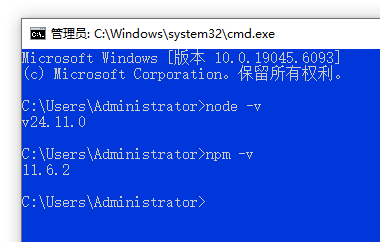
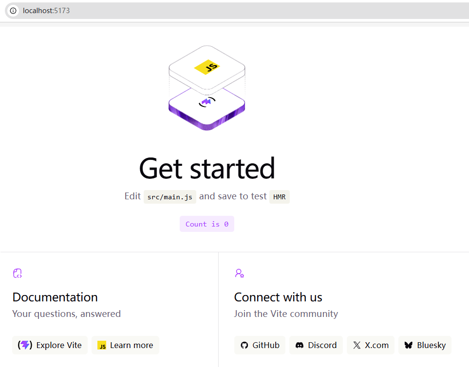
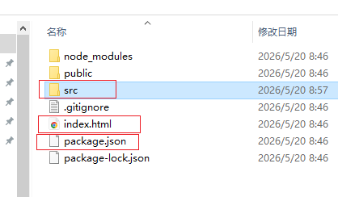
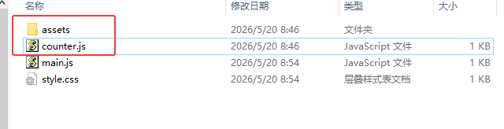

# Vite 学习笔记

> 当前版本：`v0.1.2`  
> 学习目标：从零开始理解 Vite，不只是会运行命令，而是弄清楚它在现代前端项目中的位置、作用、目录结构、开发流程和构建流程。

这是一个用于系统学习 Vite 的中文知识库。

本仓库从零开始记录 Vite 的核心概念、项目搭建流程、目录结构、常用命令、开发环境与生产环境的区别，以及后续深入学习过程中的实践和总结。

---

## 目录

- [Vite 学习笔记](#vite-学习笔记)
  - [目录](#目录)
  - [1. Vite 是什么？](#1-vite-是什么)
  - [2. Vite 不是什么？](#2-vite-不是什么)
  - [3. Vite 为什么出现？](#3-vite-为什么出现)
  - [4. Vite 主要替代了什么？](#4-vite-主要替代了什么)
  - [5. 最小 Vite 项目搭建](#5-最小-vite-项目搭建)
    - [5.1 检查 Node.js 和 npm](#51-检查-nodejs-和-npm)
    - [5.2 创建一个最小 Vite 项目](#52-创建一个最小-vite-项目)
    - [5.3 进入项目目录](#53-进入项目目录)
    - [5.4 安装依赖](#54-安装依赖)
    - [5.5 启动开发服务器](#55-启动开发服务器)
  - [6. 常用命令说明](#6-常用命令说明)
    - [开发预览](#开发预览)
    - [构建项目](#构建项目)
    - [预览构建结果](#预览构建结果)
  - [7. Vite 项目目录结构](#7-vite-项目目录结构)
  - [8. 核心文件说明](#8-核心文件说明)
    - [8.1 package.json](#81-packagejson)
    - [8.2 index.html](#82-indexhtml)
    - [8.3 src/main.js](#83-srcmainjs)
    - [8.4 src/style.css](#84-srcstylecss)
  - [9. src 和 public 的区别](#9-src-和-public-的区别)
    - [src](#src)
    - [public](#public)
    - [src 与 public 对比](#src-与-public-对比)
  - [10. node\_modules 可以删除吗？](#10-node_modules-可以删除吗)
  - [11. package-lock.json 可以删除吗？](#11-package-lockjson-可以删除吗)
  - [12. .gitignore 是什么？](#12-gitignore-是什么)
  - [13. public 可以删除吗？](#13-public-可以删除吗)
  - [14. src 中的默认文件可以删除吗？](#14-src-中的默认文件可以删除吗)
  - [15. 开发环境和生产环境](#15-开发环境和生产环境)
    - [开发环境](#开发环境)
    - [生产环境](#生产环境)
  - [16. 什么是 HMR？](#16-什么是-hmr)
  - [17. 什么是 ES Modules？](#17-什么是-es-modules)
  - [18. 自己创建一个模块](#18-自己创建一个模块)
  - [19. Vite 和 React、Vue 的关系](#19-vite-和-reactvue-的关系)
  - [20. vite.config.js 是什么？](#20-viteconfigjs-是什么)
  - [21. 常见报错：找不到 package.json](#21-常见报错找不到-packagejson)
  - [22. 最小源码结构](#22-最小源码结构)
  - [23. 推荐仓库目录结构](#23-推荐仓库目录结构)
  - [24. 示例项目运行入口](#24-示例项目运行入口)
  - [25. 推荐学习路线](#25-推荐学习路线)
    - [第一阶段：基础使用](#第一阶段基础使用)
    - [第二阶段：项目结构](#第二阶段项目结构)
    - [第三阶段：模块化](#第三阶段模块化)
    - [第四阶段：构建与部署](#第四阶段构建与部署)
    - [第五阶段：框架结合](#第五阶段框架结合)
    - [第六阶段：深入原理](#第六阶段深入原理)
  - [26. 后续计划](#26-后续计划)
  - [27. 当前理解总结](#27-当前理解总结)
  - [License](#license)

---

## 1. Vite 是什么？

Vite 不是一个前端框架，也不是运行环境。

它可以理解为：

> Vite 是现代前端项目的开发服务器和打包工具。

它主要负责两件事：

1. 开发阶段：快速启动本地开发服务器，支持热更新。
2. 构建阶段：将源码打包成可以部署上线的静态文件。

常见命令：

```bash
npm run dev
npm run build
npm run preview
```

---

## 2. Vite 不是什么？

Vite 不是 Node.js。

Node.js 是运行 JavaScript 工具的环境。

Vite 运行在 Node.js 之上。

Vite 也不是 npm。

npm 是包管理工具，用来安装依赖和执行脚本。

Vite 也不是 React 或 Vue。

React、Vue 是前端框架。

Vite 是帮助 React、Vue 或普通 JavaScript 项目运行和打包的工具。

关系可以理解为：

```text
Node.js
  └── npm
       └── Vite
            ├── Vanilla JavaScript 项目
            ├── React 项目
            ├── Vue 项目
            └── 其他前端项目
```

---

## 3. Vite 为什么出现？

在 Vite 出现之前，很多前端项目使用 Webpack、Vue CLI、Create React App 等工具。

这些工具在项目较大时，经常会遇到：

- 启动慢
- 修改代码后刷新慢
- 配置复杂
- 开发体验不够轻快

Vite 出现的背景是：

> 现代浏览器已经支持 ES Modules，前端项目不一定需要在开发阶段先完整打包。

传统工具的思路更接近：

```text
先整体打包项目 → 再启动开发页面
```

Vite 的开发思路更接近：

```text
先启动开发服务器 → 浏览器需要哪个模块，就处理哪个模块
```

因此，Vite 在开发阶段通常启动更快，热更新也更快。

---

## 4. Vite 主要替代了什么？

Vite 在很多新项目中主要替代的是：

- Webpack
- Webpack Dev Server
- Vue CLI
- Create React App
- Parcel 的部分使用场景

但需要注意：

Vite 并没有完全取代 Webpack。

Webpack 仍然存在，并且很多老项目和复杂项目仍然在使用 Webpack。

Vite 更适合现代前端项目，尤其是新项目。

---

## 5. 最小 Vite 项目搭建

### 5.1 检查 Node.js 和 npm

在命令行中运行：

```bash
node -v
npm -v
```

如果能看到版本号，说明 Node.js 和 npm 已经安装成功。

例如：

```bash
v24.11.0
11.6.2
```

实际截图：



这张截图说明：电脑已经具备运行 Vite 项目的基础环境。后续如果运行 `npm run dev` 仍然报错，通常就不是 Node.js 或 npm 没装好，而是目录不对、缺少 `package.json`，或者项目依赖没有安装。

---

### 5.2 创建一个最小 Vite 项目

进入桌面目录：

```bash
cd C:\Users\Administrator\Desktop
```

创建一个原生 JavaScript 的 Vite 项目：

```bash
npm create vite@latest vite-demo -- --template vanilla
```

其中：

```text
vite-demo
```

是项目文件夹名称。

```text
--template vanilla
```

表示创建一个普通 JavaScript 项目，不使用 React 或 Vue。

执行完成后，桌面会多出一个名为 `vite-demo` 的项目文件夹。

---

### 5.3 进入项目目录

```bash
cd vite-demo
```

---

### 5.4 安装依赖

```bash
npm install
```

执行后会生成：

```text
node_modules
package-lock.json
```

---

### 5.5 启动开发服务器

```bash
npm run dev
```

成功后会看到类似地址：

```text
http://localhost:5173/
```

在浏览器中打开这个地址，就可以看到 Vite 默认页面。

实际截图：



这张截图说明：Vite 本地开发服务器已经启动成功，`localhost:5173` 是当前电脑上的本地预览地址。此时修改 `src/main.js` 或 `src/style.css`，保存后浏览器通常会自动更新。

---

## 6. 常用命令说明

### 开发预览

```bash
npm run dev
```

作用：

启动本地开发服务器。

常见地址：

```text
http://localhost:5173/
```

特点：

- 启动快
- 支持热更新
- 适合开发调试
- 不适合直接作为正式上线服务

---

### 构建项目

```bash
npm run build
```

作用：

将源码打包成正式上线使用的文件。

默认会生成：

```text
dist
```

`dist` 文件夹中的内容才是最终可以部署到服务器的静态文件。

---

### 预览构建结果

```bash
npm run preview
```

作用：

本地预览 `dist` 构建结果。

注意：

`preview` 只是本地检查打包结果，不是正式生产服务器。

---

## 7. Vite 项目目录结构

一个最小 Vite 项目大概如下：

```text
vite-demo
├── index.html
├── package.json
├── package-lock.json
├── node_modules
├── public
├── src
│   ├── main.js
│   └── style.css
└── .gitignore
```

实际项目根目录截图：



从截图可以看到，除了核心的 `src`、`index.html`、`package.json`，项目中还会有 `node_modules`、`public`、`.gitignore`、`package-lock.json` 等文件或目录。

其中：

- `src`：源码目录。
- `index.html`：页面入口。
- `package.json`：npm 项目配置和命令入口。
- `node_modules`：依赖包目录，本地开发需要，但一般不提交到 GitHub。
- `public`：静态资源目录。
- `.gitignore`：告诉 Git 哪些文件不要提交。
- `package-lock.json`：npm 依赖版本锁定文件。

---

## 8. 核心文件说明

### 8.1 package.json

`package.json` 是项目的核心配置文件。

它记录了：

- 项目名称
- 项目依赖
- 可执行命令
- 开发工具配置

常见内容：

```json
{
  "scripts": {
    "dev": "vite",
    "build": "vite build",
    "preview": "vite preview"
  },
  "devDependencies": {
    "vite": "^x.x.x"
  }
}
```

当运行：

```bash
npm run dev
```

npm 会去 `package.json` 中查找：

```json
"dev": "vite"
```

然后执行：

```bash
vite
```

如果当前目录下没有 `package.json`，就会出现类似报错：

```text
Could not read package.json
ENOENT: no such file or directory
```

这说明当前目录不是项目根目录。

---

### 8.2 index.html

`index.html` 是 Vite 项目的入口 HTML 文件。

通常包含：

```html
<div id="app"></div>
<script type="module" src="/src/main.js"></script>
```

这句很关键：

```html
<script type="module" src="/src/main.js"></script>
```

它表示页面会加载 `src/main.js` 作为 JavaScript 入口。

整体关系是：

```text
index.html
   ↓
src/main.js
   ↓
其他 JS、CSS、图片、组件
```

---

### 8.3 src/main.js

`src/main.js` 是前端项目的主要 JavaScript 入口。

一个最小示例：

```js
import './style.css'

document.querySelector('#app').innerHTML = `
  <div class="page">
    <h1>我的第一个 Vite 项目</h1>
    <p>这是一个使用 Vite 创建的最小网页。</p>
    <button id="btn">点击我</button>
  </div>
`

document.querySelector('#btn').addEventListener('click', () => {
  alert('你好，Vite！')
})
```

---

### 8.4 src/style.css

`src/style.css` 用来编写页面样式。

示例：

```css
body {
  margin: 0;
  font-family: Arial, sans-serif;
  background: #f5f5f5;
}

.page {
  padding: 60px;
  text-align: center;
}

h1 {
  color: #333;
}

button {
  padding: 10px 20px;
  border: none;
  background: black;
  color: white;
  cursor: pointer;
  border-radius: 6px;
}
```

---

## 9. src 和 public 的区别

### src

`src` 用来放源码。

例如：

```text
src/main.js
src/style.css
src/assets/logo.png
```

`src` 中的资源通常通过 `import` 引入：

```js
import './style.css'
import logo from './assets/logo.png'
```

这些文件会经过 Vite 处理、优化和打包。

---

### public

`public` 用来放静态资源。

例如：

```text
public/logo.png
public/favicon.ico
```

引用方式：

```html

```

`public` 中的文件不会被 Vite 特殊处理，通常会原样复制到最终构建结果中。

---

### src 与 public 对比

| 目录 | 是否参与构建处理 | 常见引用方式 | 适合放什么 |
|---|---|---|---|
| src | 是 | `import` | JS、CSS、组件、参与打包的图片 |
| public | 否，通常原样复制 | `/文件名` | favicon、固定静态文件、不会被处理的资源 |

---

## 10. node_modules 可以删除吗？

`node_modules` 是 npm 下载的依赖包目录。

本地开发时需要它。

可以删除，但删除后必须重新执行：

```bash
npm install
```

一般情况：

| 场景 | 是否需要 node_modules |
|---|---|
| 本地开发 | 需要 |
| 上传 GitHub | 不需要 |
| 发给别人 | 通常不需要 |
| 依赖出问题时 | 可以删除后重新安装 |

通常 `.gitignore` 会排除：

```text
node_modules
```

---

## 11. package-lock.json 可以删除吗？

`package-lock.json` 是 npm 自动生成的依赖锁定文件。

它的作用是：

> 尽量保证不同电脑、不同时间安装到一致的依赖版本。

可以删除，但不建议随意删除。

删除后执行：

```bash
npm install
```

会重新生成。

---

## 12. .gitignore 是什么？

`.gitignore` 用来告诉 Git 哪些文件不要提交到仓库。

常见内容：

```text
node_modules
dist
.env
```

建议保留 `.gitignore`。

特别是：

```text
node_modules
```

通常不应该提交到 GitHub。

---

## 13. public 可以删除吗？

如果项目没有使用 `public` 中的资源，可以删除。

例如，如果 `main.js` 或 `index.html` 中没有引用：

```text
/vite.svg
```

那么默认的 `public/vite.svg` 可以删除。

判断原则：

> 如果没有任何代码引用它，就可以删除。

结合项目根目录截图：


建议初学阶段保留 `.gitignore`、`package-lock.json` 和 `node_modules`，如果确认没有使用 `/vite.svg`，可以删除 `public` 中的默认示例资源。

---

## 14. src 中的默认文件可以删除吗？

Vite 默认项目里可能包含：

```text
src/assets
src/counter.js
src/main.js
src/style.css
```

实际截图：



其中：

- `main.js` 是入口文件，不要删除。
- `style.css` 是样式文件，可以保留。
- `counter.js` 是默认示例代码，可以删除。
- `assets` 是默认资源目录，如果没有引用，也可以删除。

删除前需要检查 `main.js` 中是否还有类似代码：

```js
import javascriptLogo from './assets/javascript.svg'
import { setupCounter } from './counter.js'
```

如果还有引用，就不能直接删除。

应先删除对应的 `import` 代码，再删除文件。

推荐顺序：

1. 先修改 `src/main.js`，删除对 `assets` 和 `counter.js` 的引用。
2. 保存后确认浏览器页面正常。
3. 再删除 `src/assets` 和 `src/counter.js`。
4. 保留 `src/main.js` 和 `src/style.css`。

---

## 15. 开发环境和生产环境

### 开发环境

命令：

```bash
npm run dev
```

特点：

- 面向开发者
- 启动快
- 支持热更新
- 运行在 localhost
- 不适合直接上线

常见地址：

```text
http://localhost:5173/
```

---

### 生产环境

命令：

```bash
npm run build
```

输出：

```text
dist
```

特点：

- 面向真实用户
- 文件被压缩和优化
- 用于部署到服务器、CDN、静态网站平台

---

## 16. 什么是 HMR？

HMR 是 Hot Module Replacement，中文可以叫：

> 热模块替换

简单理解：

> 修改代码后，浏览器页面可以自动更新，而且不一定需要整页刷新。

例如修改 CSS：

```css
h1 {
  color: red;
}
```

保存后，浏览器中的标题颜色会自动变化。

这是 Vite 开发体验好的原因之一。

---

## 17. 什么是 ES Modules？

ES Modules 是现代 JavaScript 的模块系统。

常见语法：

```js
import './style.css'
import { add } from './math.js'

export function add(a, b) {
  return a + b
}
```

Vite 利用了现代浏览器对 ES Modules 的支持。

这也是 Vite 在开发阶段可以快速启动的重要原因。

---

## 18. 自己创建一个模块

可以新建文件：

```text
src/message.js
```

内容：

```js
export const message = '你好，Vite'
```

然后在 `main.js` 中使用：

```js
import './style.css'
import { message } from './message.js'

document.querySelector('#app').innerHTML = `
  <h1>${message}</h1>
`
```

这可以帮助理解前端模块化。

---

## 19. Vite 和 React、Vue 的关系

Vite 可以用于创建不同类型的前端项目。

创建原生 JavaScript 项目：

```bash
npm create vite@latest vanilla-demo -- --template vanilla
```

创建 React 项目：

```bash
npm create vite@latest react-demo -- --template react
```

创建 Vue 项目：

```bash
npm create vite@latest vue-demo -- --template vue
```

Vite 本身不是 React，也不是 Vue。

它是帮助这些项目开发和打包的工具。

---

## 20. vite.config.js 是什么？

当项目需要更多配置时，会使用：

```text
vite.config.js
```

例如修改开发服务器端口：

```js
import { defineConfig } from 'vite'

export default defineConfig({
  server: {
    port: 3000
  }
})
```

这样启动后地址可能变成：

```text
http://localhost:3000/
```

也可以配置路径别名：

```js
import { defineConfig } from 'vite'
import path from 'path'

export default defineConfig({
  resolve: {
    alias: {
      '@': path.resolve(__dirname, 'src')
    }
  }
})
```

之后可以这样引入：

```js
import Button from '@/components/Button.js'
```

而不是：

```js
import Button from '../../components/Button.js'
```

---

## 21. 常见报错：找不到 package.json

报错示例：

```text
npm error enoent Could not read package.json
```

原因：

当前命令行所在目录不是项目根目录。

错误示例：

```bash
C:\Users\Administrator>npm run dev
```

如果 `C:\Users\Administrator` 下没有 `package.json`，就会报错。

正确方式：

```bash
cd C:\Users\Administrator\Desktop\vite-demo
npm run dev
```

判断当前目录是否正确：

```bash
dir
```

如果能看到：

```text
package.json
```

说明当前目录是项目根目录。

排查顺序：

1. 运行 `dir`，看当前目录有没有 `package.json`。
2. 如果没有，运行 `dir /s package.json` 搜索它的位置。
3. `cd` 到真正包含 `package.json` 的目录。
4. 再运行 `npm install` 和 `npm run dev`。

---

## 22. 最小源码结构

理论上，一个非常小的 Vite 项目可以只关注：

```text
vite-demo
├── index.html
├── package.json
└── src
    ├── main.js
    └── style.css
```

但实际本地开发中通常还会有：

```text
node_modules
package-lock.json
.gitignore
```

推荐初学阶段保留：

```text
vite-demo
├── index.html
├── package.json
├── package-lock.json
├── node_modules
├── src
│   ├── main.js
│   └── style.css
└── .gitignore
```

如果确认没有使用 `public` 中的资源，可以删除 `public`。

---

## 23. 推荐仓库目录结构

后续可以逐步扩展为：

```text
vite-learning-notes
├── README.md
├── CHANGELOG.md
├── docs
│   └── images
│       └── screenshots
│           ├── 01-node-npm-version.png
│           ├── 02-vite-localhost-preview.png
│           ├── 03-src-default-files.png
│           └── 04-root-directory-files.png
├── notes
│   ├── README.md
│   ├── 01-vite-basic.md
│   ├── 02-project-structure.md
│   ├── 03-npm-and-package-json.md
│   ├── 04-dev-build-preview.md
│   ├── 05-src-vs-public.md
│   ├── 06-vite-config.md
│   ├── 07-vite-vs-webpack.md
│   └── 08-common-errors.md
├── examples
│   ├── README.md
│   ├── 01-vanilla-basic
│   ├── 02-vanilla-modules
│   ├── 03-vanilla-counter-state
│   ├── 04-src-vs-public-assets
│   ├── 05-vite-config-and-env
│   ├── 06-vanilla-todo-localstorage
│   ├── 07-react-basic
│   └── 08-vue-basic
└── .gitignore
```

README 可以作为总入口，详细内容可以逐步拆分到 `notes` 文件夹。

---

## 24. 示例项目运行入口

`v0.1.2` 开始，仓库中新增了可以直接运行和测试的示例项目，统一放在 `examples` 目录。

建议先从原生 JavaScript 示例开始，再进入 React 和 Vue 示例：

```text
examples
├── 01-vanilla-basic
├── 02-vanilla-modules
├── 03-vanilla-counter-state
├── 04-src-vs-public-assets
├── 05-vite-config-and-env
├── 06-vanilla-todo-localstorage
├── 07-react-basic
└── 08-vue-basic
```

每个示例项目都可以独立运行。通用步骤：

```bash
cd examples/示例项目目录
npm install
npm run dev
```

常用测试命令：

```bash
npm run build
npm run preview
```

示例项目的详细说明见：[`examples/README.md`](examples/README.md)。

学习笔记的详细目录见：[`notes/README.md`](notes/README.md)。

---

## 25. 推荐学习路线

### 第一阶段：基础使用

- 理解 Vite 是什么
- 会创建项目
- 会运行开发服务器
- 会修改 `main.js`
- 会修改 `style.css`
- 会打包生成 `dist`

### 第二阶段：项目结构

- 理解 `package.json`
- 理解 `index.html`
- 理解 `src`
- 理解 `public`
- 理解 `node_modules`
- 理解 `package-lock.json`
- 理解 `.gitignore`

### 第三阶段：模块化

- 学习 `import`
- 学习 `export`
- 拆分多个 JS 文件
- 管理图片、CSS、工具函数

### 第四阶段：构建与部署

- 理解 `npm run build`
- 理解 `dist`
- 部署到静态服务器
- 部署到 GitHub Pages
- 部署到 Netlify 或 Vercel

### 第五阶段：框架结合

- Vite + Vue
- Vite + React
- Vite + TypeScript
- Vite + Tailwind CSS

### 第六阶段：深入原理

- ES Modules
- HMR 原理
- 开发服务器原理
- 依赖预构建
- Rollup 打包
- 插件系统
- 环境变量
- 路径别名
- 多页面应用
- 库模式构建

---

## 26. 后续计划

本仓库后续会继续补充：

- Vite 配置详解
- Vite 与 Webpack 对比
- Vite 项目部署方法
- Vite + React 示例
- Vite + Vue 示例
- Vite + TypeScript 示例
- Vite + Tailwind CSS 示例
- Vite 插件机制
- Vite 构建优化
- Vite 常见错误排查
- 实际项目案例

---

## 27. 当前理解总结

目前对 Vite 的理解可以总结为：

> Vite 是现代前端项目的开发服务器和打包工具。  
> 开发时，它帮助我们快速启动项目，并通过热更新提升开发体验。  
> 上线前，它帮助我们将源码构建成 `dist` 文件夹中的静态资源。  
> 它不替代 Node.js、npm、React 或 Vue，而是运行在 Node.js 之上，配合 npm 管理依赖，并服务于各种前端项目。

---

## License

本仓库主要用于个人学习记录，可自由参考。
